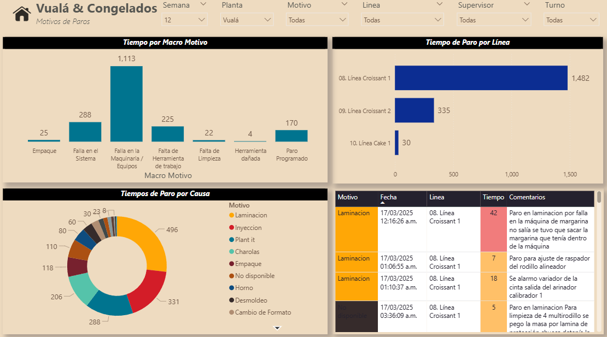

# 📊 Dashboard Paros - Power BI

Este repositorio contiene un ejemplo real de implementación de un dashboard de Power BI conectado a Power Apps, orientado al análisis de los tiempos y motivos de paro en línea de producción.

---

## 📌 Objetivo

Diseñar un tablero en Power BI para medir y visualizar los resultados de los paros registrados en la planta, permitiendo dar seguimiento al cumplimiento a las fallas recurrentes, equipos con mayor cantidad de fallos y tiempos muertos.

---

## 🛠️ Tecnologías Utilizadas

- Power BI Desktop (DirectQuery)
- Power Apps (Consultas a vistas y tablas en producción)
- DAX (Medidas complejas para disponibilidad, eficiencia, forecast, etc.)
- GitHub (para control de versiones y documentación técnica)

---

## 📁 Estructura del Repositorio

```plaintext
Paros/
├── pbix/                                   → Archivo PBIX del tablero
├── docs/
│   ├── README.md                           → Descripción general del repositorio
│   ├── Medidas_DAX.md                      → Medidas DAX documentadas
│   ├── ColumnasCalculadas.md               → DAX documentadas
│   ├── video_tutorial.md                   → Guía de uso del dashboard
├── img/
│   ├── preview_dashboard.png               → Captura del dashboard
│   └── modelo_datos.png                    → Relación entre tablas
```

---

## 📷 Preview del Dashboard



---

## 📎 Cómo utilizarlo

1. Clona este repositorio.
2. Abre el archivo `pbix/Dashboard_OEE_Coflex.pbix` con Power BI Desktop.
3. Conecta tu fuente de datos o consulta en SQL Server.
4. Revisa la documentación en `/docs` para entender cada fórmula y estructura.

---

## 📄 Licencia
